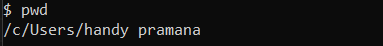
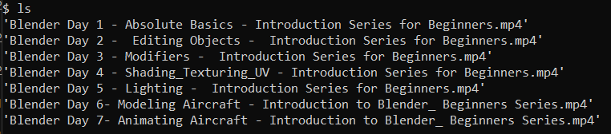
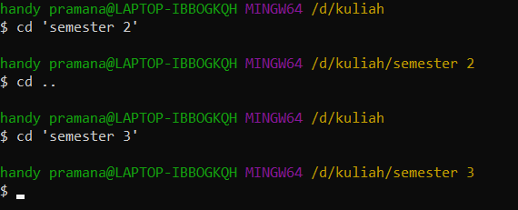
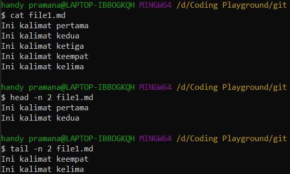
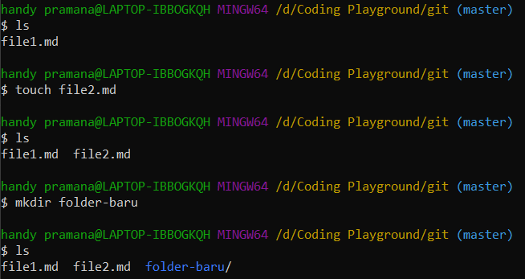
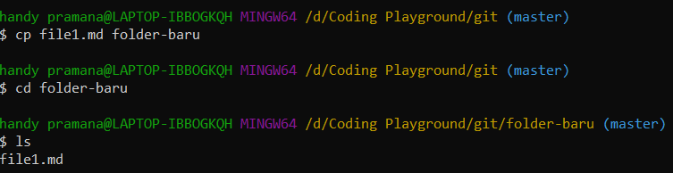
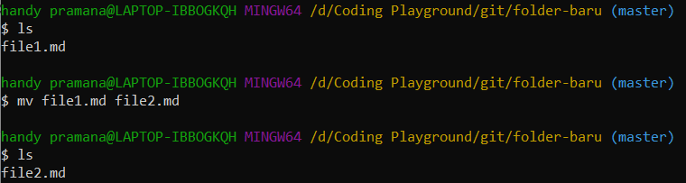
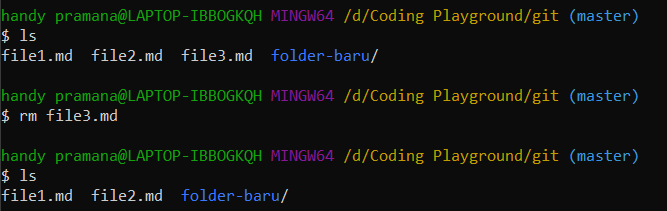
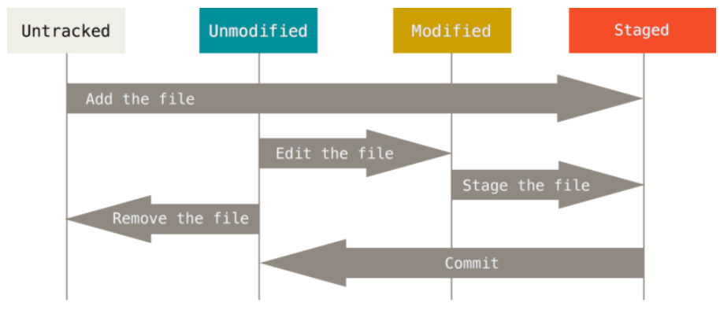

# Writing Test Week 1

## **Summary Module 1 - Unix Command Line**

### **Shell**

- Program yang memungkinkan kita untuk berinteraksi atau memberi perintah pada sistem komputer

### **Command Line Interface**

- CLI mengacu pada Shell yang berbasis teks
- Contoh CLI: bash dan cmd
- Ada juga Shell berbasis gambar yang bernama GUI seperti file manager

### **Cara Mengakses CLI**

- Gunakan aplikasi pengakses CLI (Terminal Emulator)
- Buka aplikasi cmd atau powershell untuk Windows atau bash untuk Linux dan MacOS

### **File System Structure**

- Sebuah sistem yang mengatur struktur penyimpanan data
- Windows dan Unix memiliki struktur file seperti pohon
  

### **Perintah-Perintah pada CLI**

- Melihat Current Working Directory

  - Print Working Directory
    ```
    pwd
    ```
    

- Melihat Isi Directory

  - Lists
    ```
    ls
    ls -a
    ```
    

- Berpindah Directory

  - Change Directory

    ```
    cd <directory>
    ```

    

  - tanda '..' artinya memilih direktori di atasnya (parent)
  - tanda '.' artinya memilih direktori saat itu

- Melihat Isi File

  - head: melihat file dari baris paling awal
  - tail: melihat file dari baris paling akhir
  - cat: melihat isi file
    ```
    head -n <number of line> <source>
    tail -n <number of line> <source>
    cat <file yang dituju>
    ```
    

- Membuat File & Directory

  - touch: membuat file
  - mkdir: membuat direktori
    ```
    touch <file name>
    mkdir <directory name>
    ```
    

- Menyalin File & Directory

  - cp: menyalin file
  - cp -R: menyalin direktori
    ```
    cp <source> <destination>
    cp -R <source> <destination>
    ```
    

- Memindahkan dan Merename File & Directory

  - mv: memindah atau menyalin file
  - mv -R: memindah atau menyalin direktori

    ```
    mv <source> <target>
    mv <old-name> <new-name>
    ```

    

- Menghapus File & Directory
  - rm: menghapus file
  - rm -R atau rm -d: menghapus direktori
  ```
  rm <source>
  rm -R <source>
  ```
  

---

## **Summary Module 2 - Git & GitHub Dasar**

### **Git**

- Git pada dasarnya ada suatu version control system
- Aplikasi yang melacak setiap perubahan yang terjadi pada file atau folder

### **GitHub**

- GitHub pada dasarnya merupakan version control system dengan layanan penyimpanan cloud

### **Perbedaan Git dan GitHub**

- Git disimpan secara lokal, GitHub disimpan dalam cloud
- Git diakses secara offline, GitHub diakses secara online

### **Tujuan Penggunaan Git dan GitHub**

- Sangat dibutuhkan sebagai platform kolaborasi antar programmer
- Dapat mencatat seluruh perubahan dan siapa pengubahnya
- Dapat menyimpan file secara efektif
- Memungkinkan programmer untuk mengerjakan projek secara paralel

### **Alur Git dan GitHub**

- Download Git dan ikuti proses instalasinya
- Cek apakah Git berhasil terinstall dengan command `git --version`
- Lakukan konfigurasi nama dan email sesuai GitHub
  ```
  $ git config --global user.name "John Doe"
  $ git config --global user.email "email@example.com"
  ```
- Cek keberhasilan konfigurasi dengan `git config --list`

### **Git Repository**

- Repository merupakan tempat atau direktori dimana projek kita dibuat
- Repository dibuat dengan perintah `git init <project-name>` atau `git init .` jika folder sudah dibuat

### **Git Status**

- Perintah `git status` memungkinkan kita untuk memantau kondisi perubahan yang terjadi pada tracked dan untracked file
- Terdapat 3 macam kondisi pada file
  - modified: terdapat perubahan yang belum ditandai dan belum disimpan
  - staged: perubahan sudah titandai tetapi belum disimpan
  - commited: perubahan disimpan dalam version control system
    

### **Git Add**

- Perintah `git add` memungkinkan kita untuk mengubah status untracked file menjadi unmodified (staged)
- Perintah `git add <source>` ditujukan untuk file yang spesifik, sedangkan `git add .` ditujukan untuk seluruh direktori

### **Git Commit**

- Perintah `git commit -m <commit-message>` memungkinkan kita untuk menyimpan perubahan pada virtual control system secara permanen

### **Git Log**

- Perintah `git log` memungkinkan kita untuk mendapat log mengenai siapa yang merubah, dan kapan perubahan terjadi
- Perintah `git log --oneline` dapat menampilkan log dengan lebih singkat
- Log dapat dilihat berdasarkan nomor versi, file, dan author

### **Mengecek Perubahan Isi File**

- Perintah `git diff` memungkinkan kita untuk mengetahui baris yang berubah pada file

### **Membatalkan Perubahan**

- Status belum stagged dan belum commited
  - Gunakan perintah `git checkout <source>`
- Status sudah stagged dan belum commited
  - Gunakan perintah `git reset <source>`
  - Akhiri dengan perintah `git checkout <source>`
- Status sudah commited
  - Gunakan perintah `git checkout <commit-code> <source>`
  - Tambahkan `git reset <source>`
  - Bisa juga menggunakan `git revert -n <commit-code>`

### **Publikasi Aplikasi ke Github**

- Buat akun
- Buat repo baru dan sesuaikan setting repo dengan kebutuhan
- Jalankan perintah `git remote add origin <link>`
- Upload file dari lokal dengan `git push -u origin main`

### **Cloning Github ke Local**

- Gunakan perintah `git clone <link>`

---

## **Summary Module 3 - HTML**

### **HTML**

- HTML kependekan dari Hypertext Markup Language
- Berfungsi untuk menampilkan konten pada browser
- Konten berupa teks, gambar, video, link, audio, dsb

### **Tools Pendukung HTML**

- Browser: google chrome, mozilla firefox, microsoft edge
- Code editor: visual studio code, sublime text, atom

### **Dasar-Dasar HTML**

- Struktur HTML

  ```
  <!DOCTYPE html>
  <html>
    <head>
      <meta>
      <title></title>
    </head>
    <body>
      <p>This is a paragraph</p>
    </body>
  </html>
  ```

  - HTML ditulis dalam tingkatan-tingkatan (nested)
  - Elemen yang berada di dalam elemen lain disebut child
  - Elemen yang berada di atas elemen lain disebut parent

- Elemen HTML

  - Segala bagian HTML yang tersusun atas opening tag, content, dan closing tag

- Anatomi HTML

  ```
  <p>This is a paragraph</p>
  ```

  - Elemen HTML terdiri atas 3 bagian, yaitu opening tag, content, dan closing tag
  - Ada elemen yang tidak memiliki closing tag atau content seperti img, input, dan br

- Atribut HTML

  ```
  
  ```

  - Properti yang dimiliki oleh elemen HTML

- Komentar HTML

  ```
  <!--Ini adalah komentar-->
  ```

  - Bagian dari HTML yang tidak ditampilkan pada browser
  - Berfungsi untuk menjelaskan kode

### **Menjalankan HTML**

- Cara 1
  - Copy path dimana file HTML berada
  - Paste path di browser
- Cara 2
  - Install ekstensi VS code bernama live server
  - Buka file HTML menggunakan VS code
  - Tekan Go Live di bagian kanan bawah

### **Tag yang Populer**

```

```

- menampilkan gambar

```
<video>
  <source src="" type="">
</video>
```

- menampilkan video

```
<table>
  <tr>
    <th></th>
    <th></th>
    <th></th>
  </tr>

  <tr>
    <td></td>
    <td></td>
    <td></td>
  </tr>
</table>

```

- membuat tabel

```
<form>
  <label for=""></label>
  <input type="" name="">
</form>
```

### **Semantic HTML**

- Tag-tag HTML yang memiliki arti atau memberikan konteks pada struktur web
- Contohnya adalah header, nav, section, article, aside, footer
- `<div class="header">` dapat diganti dengan tag `<header>`
- Kegunaan Semantic HTML:

  - Dapat meningkatkan aksesibilitas
  - Meningkatkan SEO
  - Lebih mudah dimaintain

### **Deploy HTML**

- Deployment adalah proses untuk mempublikasikan aplikasi kita sehingga dapat diakses pihak lain
- Dalam konteks aplikasi web, kita perlu men-deploy ke server
- Deployment HTML dapat menggunakan tools bernama Netlify
- Tahap deployment Netlify:
  - Buat akun Netlify
  - Pilih add new site
  - Pilih sumber file
  - Deploy aplikasi

---

## **Summary Module 4 - CSS**

### **CSS**

- CSS merupakan singkatan dari Cascading Style Sheets
- Berfungsi untuk memberikan style atau mendesain halaman website
- Misalnya mengubah warna, font, menyusun layout, dsb

### **Menghubungkan CSS dan HTML**

Terdapat 3 cara:

- Inline CSS

  ```
  <p style="color: red;">This is a paragraph</p>
  ```

  - Menambahkan CSS pada atribut tag HTML

- Internal CSS

  ```
  <head>
    <style>
      p {
        color: red;
      }
    </style>
  </head>
  ```

  - Menambahkan CSS dengan tag `<style></style>` pada bagian head HTML

- External CSS

  ```
  <link rel="stylesheet" href="style.css">
  ```

  - Menghubungkan file `.css` ke HTML dengan tag `<link>`

### **CSS Syntax**

- Syntax CSS terdiri atas selector yang diikuti dengan properti beserta nilai dari properti tersebut
  ```
  selector {
    property1: value1;
    property2: value2;
  }
  ```

### **CSS Tag Name, Class Name, dan ID Name**

Elemen dapat ditarget oleh CSS dengan 3 jenis nama

- Tag name
  - nama tag HTML yang ingin ditarget
  - ditarget dengan syntax `tag-name {}`
- Class name
  - nilai atribut class pada tag HTML
  - nilai class yang sama boleh digunakan pada lebih dari 1 elemen HTML
  - ditarget dengan syntax `.class-name {}`
- ID name
  - nilai atribut id pada tag HTML
  - nilai id yang sama hanya boleh digunakan pada 1 elemen HTML
  - ditarget dengan syntax `#id-name {}`

### **CSS Selector**

- Chainning Selector

  ```
  tag-name.class-name#id-name {
    background-color: blue;
  }
  ```

  - Kita dapat menarget elemen HTML dari gabungan tag, class, dan id name
  - Style yang akan diterapkan adalah styling dengan target yang lebih spesifik
  - styling dengan target id memiliki prioritas tertinggi, diikuti dengan class, lalu tag name
  - ada juga value CSS yang mengatur styling property menjadi prioritas tertinggi, yaitu `!important`

- Nested Selector

  ```
  parent-name child-name {
    margin: 20px;
  }
  ```

  - Menarget elemen HTML yang merupakan child dari suatu parent
  - Ditulis dengan memberikan spasi antara parent name dengan child name

- Multiple Selector
  ```
  elemen1, elemen2, elemen3 {
    color: red;
  }
  ```
  - Jika lebih dari 1 elemen memiliki styling sama, kita dapat menggunakan multiple selector untuk meringkas kode
  - Ditulis dengan menggunakan tanda koma pada setiap elemen

### **Responsive Web Design**

- Bertujuan agar website tetap terlihat rapi walau dilihat melalui device dengan ukuran berbeda-beda
- Dilakukan dengan memberikan styling yang berbeda pada tiap ukuran device
- Untuk memisahkan styling berdasarkan ukuran atau kondisi tertentu dapat menggunakan media query

  ```
  @media screen and (max-width: 600px) {
    body {
      background-color: lightblue;
    }
  }
  ```

### **Flexbox**

- Konsep pada CSS yang mengatur layout dengan mengatur posisinya terhadap sumbu x dan y serta distribusi jaraknya
- Terdiri atas kontainer dan item-item di dalamnya

### **Properti pada Flexbox**

- flex-direction: mengatur tata letak item child

  - row: tata letak baris dari kiri ke kanan
  - row-reverse: tata letak baris dari kanan ke kiri
  - column: tata letak kolom dari atas ke bawah
  - column-reverse: tata letak kolom dari bawah ke atas

- flex-wrap: mengatur penyebaran item menjadi lebih dari satu baris atau kolom

  - nowrap: tiap item berada di satu baris
  - wrap: item yang tersisa dapat berada di baris baru
  - wrap-reverse: seperti wrap namun dibalik dari baris bawah ke atas

- flex-flow: gabungan dari flex-direction dan flex-wrap

  - row nowrap
  - column wrap
  - column reverse
  - row-reverse wrap-reverse

- order: mengatur urutan susunan item

  - nilai -1: item berada di paling kiri
  - nilai 0: item tetap pada urutan semula
  - nilai 1: item berada di urutan terakhir

- justify-content: mengatur tata letak dan jarak secara horizontal

  - flex-start: item berada di ujung kiri
  - flex-end: item berada di ujung kanan
  - center: item berada di tengah
  - space-between: memberi jarak antar sisi elemen yang bersinggungan
  - space-around: memberi jarak di sisi kiri dan kanan elemen
  - space-evenly: memberi jarak di sisi kiri dan kanan seluruh elemen secara rata

- align-items: mengatur tata letak dan jarak secara vertikal

  - flex-start: item berada di atas
  - flex-end: item berada di bawah
  - center: item berada di tengah
  - baseline: item disejajarkan berdasarkan isi konten
  - strech: item di-strech dari atas hingga bawah kontainer

- align-self: mengatur item yang spesifik pada kontainer

  - memiliki nilai yang sama dengan align-item

- align-content: memiliki konsep yang mirip dengan align-item tetapi digunakan pada elemen yang lebih dari 1 baris

- flex-grow: mengatur size dari elemen secara spesifik agar lebih besar

- flex-shrink: mengatur size dari elemen secara spesifik agar lebih keci

- flex-basis: mengatur width seluruh elemen

---

## **Summary Module 5 - Algoritma dan Struktur Data**

### **Algoritma**

- Urutan langkah yang sistematis dan logis untuk menyelesaikan masalah
- Dalam programming, bahasa pemrogramman adalah sarana untuk mengimplementasikan algoritma

### **Ciri-Ciri Algoritma**

Terdapat 4 ciri dari algoritma:

- Memiliki input
- Memiliki output
- Tidak ambigu (definiteness)
- Memiliki titik penyelesaian (finiteness)
- Efektif dan efisien untuk dilakukan

### **Jenis Proses Algoritma**

Terdapat 4 proses dalam algoritma:

- Sequence: proses yang dijalankan berurutan
- Selection: proses yang dijalankan jika memenuhi kondisi tertentu
- Iteration: proses yang terus dijalankan hingga memenuhi suatu kondisi
- Concurrent: proses yang dijalankan beriringan dengan proses lain

### **Penyajian Algoritma**

Algoritma dapat disajikan dalam 3 cara:

- Deskriptif: menuliskan algoritma dalam bentuk deskripsi
- Flow chart: menuliskan algoritma dalam bentuk diagram alir
- Pseudocode: menuliskan algoritma dalam bentuk yang mirip dengan bahasa pemrograman tetapi lebih general

### **Big O Notation**

- Salah satu pengukuran untuk menentukan baik tidaknya algoritma adalah space and time cost
- space and time mengacu pada seberapa besar memori yang dipakai dan seberapa cepat algoritma dijalankan

  ```
  function sum(n) {
    let total = 0;
    for (let = 1; i <= n; i++) {
      total = total +1;
    }
    return total;
  }
  ```

  ```
  function sum(n) {
    return n * (n + 1) / 2;
  }
  ```

- Big O Notation merupakan salah satu cara yang formal untuk mendeskripsikan performa suatu algoritma
- Tiap-tiap proses yang dijalankan direpresentasikan dengan `n`
- Jika terdapat 5 operasi, maka terdapat `5n`
- Big O berfokus pada pertumbuhan komputasi secara general tanpa memperhatikan angka pastinya
- Jika terdapat algoritma dengan 2, 3, maupun 4 operasi, maka tetap akan ditulis `O(n)`
- Urutan kompleksitas algoritma dari yang terbaik menuju terburuk
  - O(1)
  - O(log n)
  - O(n)
  - O(n\*log n)
  - O(n<sup>2</sup>)

### **Contoh Algoritma pada Javascript**

- Sorting: algoritma untuk mengurutkan item berdasarkan urutan tertentu
- Contoh algoritma sorting:
  - Bubble Sort
    - Bandingkan elemen yang bersebelahan lalu tukar jika urutannya tidak sesuai
    - Ulangi langkah sebanyak jumlah item - 1
  - Selection sort
    - Asumsikan elemen pertama sebagai elemen terkecil
    - Cari apakah ada elemen lain yang lebih kecil
    - Jika ada, tukar posisinya
    - Ulangi proses sebanyak jumlah item - 1
  - Merge sort
    - Partisi tiap-tiap elemen
    - Gabungkan partisi-partisi yang bersebelahan secara urut
    - Lakukan terus menerus hingga seluruh partisi telah digabungkan

### **Struktur Data**

- Suatu format untuk mengorganisasi dan mengatur bagaimana data disimpan
- Bertujuan untuk meningkatkan efisiensi ketika mengakses dan memodifikasi data
- Contoh struktur data: array, stack, queue, linked list, hashmap, tree, graph

### **Array**

- Suatu kumpulan item yang disimpan secara kontinu dalam memori
- Dimulai dari indeks 0

  ```
  let arr = ['a', 'b', 'c', 'd']
  ```

### **Stack**

- Cara penyimpanan data yang menggunakan konsep last in first out
- Data yang terakhir masuk perlu dikeluarkan terlebih dahulu
- Dapat diibaratkan sebagai tumpukan barang

### **Queue**

- Cara penyimpanan data yang menggunakan konsep first in first out
- Data yang paling lama masuk perlu dikeluarkan terlebih dahulu
- Dapat diibaratkan sebagai antrian kasir

### **Linked List**

- Cara penyimpanan data yang menggunakan konsep node yang saling berhubungan
- Tiap-tiap node memiliki 2 properti, yaitu data dan lokasi item selanjutnya
